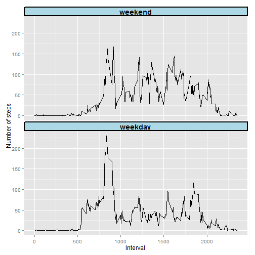

# Reproducible Research: Peer Assessment 1


## Loading and preprocessing the data

```r
dat <- read.csv("activity.csv", header = T, 
        colClasses = c("numeric", "character", "numeric"))
# Check the total observations:
nrow(dat) == 17568
```

```
## [1] TRUE
```

```r
# Change the varialbe date from character to "Date" class.
dat$date <- as.Date(dat$date, format = "%Y-%m-%d")
```

## What is mean total number of steps taken per day?

For this part of the assignment, you can ignore the missing values in the dataset.

1. Make a histogram of the total number of steps taken each day

2. Calculate and report the mean and median total number of steps taken per day


```r
# First delete missing values.
datq1 <- na.omit(dat)
# Create a factor variable for each day
datq1$dfactor <- factor(datq1$date)
# create a new data set for the total number of steps taken each day.
s <- as.data.frame(tapply(datq1$steps, datq1$dfactor, sum))
s$date <- row.names(s)
names(s) <- "steps"
hist(s$steps, main = "Total Number of Steps Taken Each Day", 
     col = "blue", xlab = "Steps")
```

 

```r
meanSteps <- format(mean(s$steps), scientific = FALSE, digits = 7)
medianSteps <- format(median(s$steps), scientific = FALSE)
```

The mean of total number of steps taken per day is 10766.19, and the median of total number of steps taken per day is 10765.


## What is the average daily activity pattern?

1. Make a time series plot (i.e. type = "l") of the 5-minute interval (x-axis) and the average number of steps taken, averaged across all days (y-axis)

2. Which 5-minute interval, on average across all the days in the dataset, contains the maximum number of steps?

```r
# Create a new data frame for this question
s2 <- datq1
# Create a factor variable for intervals
s2$finterval <- factor(s2$interval)
# Create a data frame for steps average across all days.
s2 <- as.data.frame(tapply(s2$steps, s2$finterval, mean))
names(s2) <- "meanSteps"
s2$interval <- row.names(s2)
# Make the plot using ggplot2
library(ggplot2)
ggplot(s2, aes(x = as.numeric(interval), y = meanSteps, group = 1)) + 
    geom_line() +
    xlab("5-minute interval") +
    ylab("average steps taken across all days") +
    ggtitle("Average Daily Activity Pattern") +
    scale_x_discrete(breaks=c(500, 1000, 1500, 2000, 2500))
```

 

```r
MaxSteps <- max(s2$meanSteps)
MaxStepsInt <- s2$interval[which(s2$meanSteps == MaxSteps)]
```

Therefore, the 5-minute interval that contains the maximum number of steps is 835

## Imputing missing values

```r
# Calculate the number of row with NA in steps variable
NAs <- nrow(dat[dat$steps == NA, ])
# Now we can fill all the missing values using average steps
# acrossing all days obtained in previous part.
# First create a new data set with mean steps acrossing all days.
newdat <- cbind(dat, rep(s2$meanSteps, (nrow(dat)/nrow(s2))))
names(newdat)[4] <- "meanSteps"
# fill missing values
for (i in 1:nrow(newdat)) {
    newdat$steps[i] <- (ifelse(is.na(newdat$steps[i]), 
    newdat$meanSteps[i], newdat$steps[i]))}
# Create a factor variable to calculate sum of steps each day
newdat$fdate <- factor(newdat$date)
# Now calculate the total numbers of steps take each day
SumSteps <- aggregate(newdat$steps, list(newdat$fdate), sum)
names(SumSteps) <- c("Date", "Steps")
# Make the histogram
hist(SumSteps$Steps, main = "Total Number of Steps Taken Each Day", 
     col = "green", xlab = "steps")
```

 

```r
# Calculate the mean and median total number of steps taken per day
meanSteps2 <- format(mean(SumSteps$Steps), scientific = FALSE)
medianSteps2 <- format(median(SumSteps$Steps), scientific = FALSE)
```

The total number of rows with NAs is 17568. The mean and median for the new dataset is 10766 and 10766, respectively.
These values are very close to the estimates from the first part of the assignment.


## Are there differences in activity patterns between weekdays and weekends?

```r
v <- newdat[, 1:3]
v$weekday <- weekdays(v$date)
for (i in 1:nrow(v)) {
    if (v$weekday[i] == "Saturday" || v$weekday[i] == "Sunday"){
        v$fweekday[i] <- "weekend"}
    else v$fweekday[i] <- "weekday"
}
v$fweekday <- factor(v$fweekday, levels = c("weekend", "weekday"))
gv <- aggregate(v$steps, list(v$interval, v$fweekday), mean)
names(gv) <- c("interval", "weekday", "steps")
# Make the graph using ggplot2
library(ggplot2)
ggplot(gv, aes(x = interval, y = steps)) + geom_line() +
    facet_wrap(~ weekday, ncol = 1) + ylab("Number of steps") + 
    xlab("Interval") +
    theme(strip.text = element_text(face="bold", size=rel(1.2)),
          strip.background = element_rect(fill="lightblue", 
                        colour="black", size=1))
```

 

From the two plots we can the patterns of steps taken are very similar between weekends and weekdays. But we still can see some interesting difference between the two periods: there are more steps taken in weekdays among the intervals from 500 to 1000, and people take more steps during weekends within intervals from 1000 to 1500.
